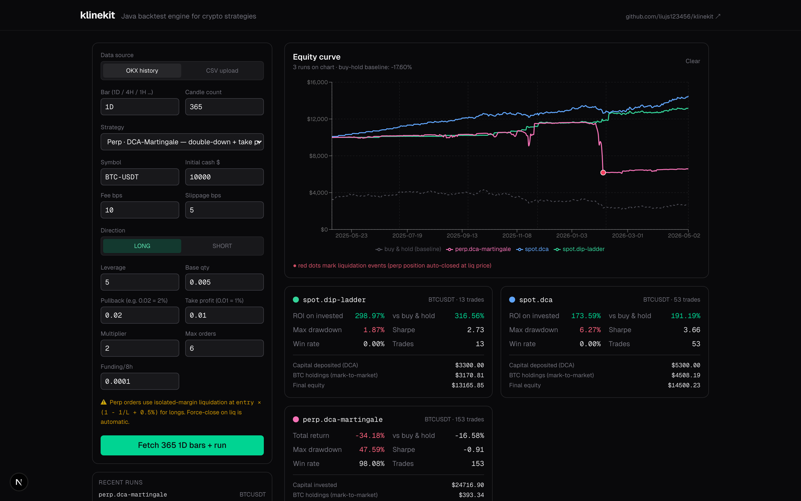

# klinekit

Java backtest engine for crypto trading strategies — spot DCA, dip-ladder, perp Grid, perp DCA-Martingale. Multi-module Gradle (core / persistence / api / cli) + Next.js dashboard.



> **Status:** **M1 + M2 + M3 + dashboard + OKX live data + risk controls + Dockerized stack shipped.**
> Core engine (spot + perp), 4 strategies (each with realistic cash-flow modes),
> auto-overlaid buy-and-hold baseline on every backtest, CLI with
> `fetch` / `backtest`, Spring Boot REST API + Postgres persistence with Flyway,
> OpenAPI docs, Next.js dashboard with strategy parameter forms and equity-curve
> overlay (with liquidation markers), OKX history candles + funding rates,
> parallel batch backtests on Java 21 virtual threads, full Docker stack,
> cross-project hook into crypto-dca-monitor's morning + weekly ntfy pushes.
> 50 tests across modules.

## Why

- Most retail crypto traders run strategies live without ever back-testing them. klinekit makes it cheap to ask *"what would this have actually done?"* before wiring real capital.
- The core ships as a **standalone Spring-free jar** so it can be embedded in scripts, services, or notebooks. The (forthcoming) REST API is a thin layer on top.
- Designed in idiomatic **Java 21** — records, sealed types, switch expressions, pattern matching. No Lombok in core.

## Strategies

klinekit ships four strategies. Every backtest auto-overlays a **buy-and-hold
baseline** (dashed grey on the chart) so you immediately see whether the
strategy actually beat "do nothing".

### `spot.dca` — Dollar-Cost Averaging

Buys `usdPerBuy` worth of `symbol` every `intervalDays` days. Three cash modes
control where the money comes from:

| Mode | What it models | When to use it |
|---|---|---|
| **`AUTO_INJECT`** *(default)* | Recurring deposit. Each interval, `usdPerBuy` is injected from outside the account ("paycheck → buy BTC"). Initial cash is irrelevant. | The realistic, ongoing-income DCA case. **Use this by default.** |
| **`PHASED`** | A finite total budget spread evenly across the entire backtest window. `usdPerBuy` is auto-derived as `phasedBudget / numberOfIntervals`. | "I have $10k today; if I had drip-fed it over the last 3 years, what would have happened?" |
| **`LUMP`** | Spends down a fixed `initialCash` pool by `usdPerBuy` each interval, then stops and holds. | What-if analysis: "what if I had stopped DCAing after 2 months?" Mostly a teaching tool. |

For DCA the dashboard reports **ROI on invested capital** (`(finalEquity − totalInjected) / totalInjected`) instead of `(finalEquity − initialCash) / initialCash`, because that's what actually answers "did this DCA earn me money."

### `spot.dip-ladder` — Tier-based dip buying

Port of the live strategy used in [`crypto-dca-monitor`](https://github.com/liujs123456/crypto-dca-monitor). Buys $100/$200/$400/$800 at -10/-15/-22/-32% from a rolling 30-day high. Each tier fires once and re-arms only after a 5% rebound from its trigger. Auto-inject defaults to ON, so deeper tiers always fire when triggered regardless of starting balance.

### `perp.grid` — Bidirectional grid on a perpetual swap

Sets up evenly-spaced price levels between `lowerBound` and `upperBound`. On each downward level cross, opens a leveraged long; on each upward level cross above the running average entry, takes profit on a slice. Auto-inject covers margin so the entire grid can fire even when the account starts empty.

### `perp.dca-martingale` — OKX 合约马丁

Opens a leveraged position, doubles down by `multiplier` each time price moves against you by `pullbackPct`, closes the whole position when price recovers by `takeProfitPct` above the running average entry. Two optional risk controls (off by default, **strongly recommended on**):

- **`stopLossPct`** — close the position when uPnL drops to `-stopLossPct × posted margin`. A 50% setting on 5x leverage triggers at ~10% adverse price move on the initial entry.
- **`trailingStopPct`** — once profitable, lock in the running peak; close if mark price retraces from peak by this fraction.

`perp.dca-martingale` does **not** use auto-inject — perp accounts are real margin pools, so the strategy is bounded by `maxOrders × 2^(maxOrders-1) × baseQty` worth of margin. If the pool isn't big enough it stops adding. This is intentional.

## Headline result — what does the data actually show?

**1000 days of BTC-USDT (≈2023-08 → 2026-05; BTC went from $29k → $78k)**, $10,000 deployed each way:

| Strategy | Final equity | ROI on invested | Max drawdown | Trades |
|---|---:|---:|---:|---:|
| **Buy & hold** | **$26,634** | **+166%** | high | 1 |
| `spot.dca` PHASED ($10/day × 1000) | $12,340 | +23% | 43% | 998 |
| `spot.dip-ladder` (default tiers) | varies — wins in drawdowns, loses in trend | varies | low | varies |

**The lesson:** in a strong uptrend, no DCA-flavoured strategy beats buy-and-hold — they sacrifice upside for timing-risk reduction. The dashboard now overlays the buy-hold curve on every chart so you can see this trade-off directly.

For the opposite regime (one-year BTC drawdown 2025-05 → 2026-05, BTC -17.9%), the same dip-ladder turned **+0.16%** with a 6.5% max drawdown vs DCA's -16% / 35% drawdown — the moment DCA-style strategies actually shine. Reproducible from `sample-data/btc-1y-daily.csv`.

## Quick start

### CLI

```bash
# Build the fat jar (requires JDK 21 — Gradle auto-provisions via foojay)
./gradlew :cli:shadowJar

# Fetch real history from OKX
java -jar cli/build/libs/klinekit-cli-0.2.0.jar fetch \
    --symbol=BTC-USDT --bar=1D --count=365 --out=sample-data/btc-365d.csv

# Run a backtest against the freshly fetched candles
java -jar cli/build/libs/klinekit-cli-0.2.0.jar backtest \
    --strategy=dip-ladder \
    --csv=sample-data/btc-365d.csv \
    --cash=10000
```

### REST API + Postgres

```bash
# Start Postgres
docker compose up -d

# Boot the API (Spring Boot 3, Flyway runs migrations on first start)
./gradlew :api:bootRun

# Smoke-test (in another terminal)
./scripts/smoke-api.sh

# OpenAPI / Swagger UI
open http://localhost:8080/swagger
```

For zero-config local development (H2 in-memory DB instead of Postgres):

```bash
SPRING_PROFILES_ACTIVE=dev ./gradlew :api:bootRun
```

### Web dashboard (one command)

```bash
./scripts/dev.sh    # boots Spring API on :8080 (H2) + Next.js UI on :3000
```

Then open <http://localhost:3000>. Pick **OKX history** (auto-fetches BTC/ETH
candles by symbol + bar) or upload a CSV. Choose `dca` or `dip-ladder`, tune
params, and overlay multiple runs on the equity curve to compare strategies
side-by-side.

### Full Docker stack (Postgres + API + dashboard)

```bash
docker compose up --build           # postgres :5432, api :8080, web :3000
```

For deploying to Fly.io or Railway with public URLs, see [DEPLOY.md](DEPLOY.md).

Sample output:

```
=== klinekit backtest ===
strategy:      spot.dca
symbol:        BTCUSDT
range:         2024-01-01T00:00:00Z → 2024-01-15T00:00:00Z
candles:       15
initialCash:   $5000
finalEquity:   $5225.41
buyHoldReturn: 17.9070%   (compare baseline)
trades:        5

metrics:
  totalReturnPct     4.5081
  sharpe             22.5741
  maxDrawdownPct     0.1707
  winRatePct         0
  tradeCount         5
```

`buyHoldReturn` is printed alongside as the always-relevant baseline — a strategy that underperforms buy-and-hold isn't worth running.

## CLI

```
klinekit backtest [OPTIONS]

  -s, --strategy=<strategy>      dca | dip-ladder (more in M3: grid, dca-martingale, ma-crossover)
  -c, --csv=<csv>                Path to candle CSV
      --symbol=<symbol>          Fallback symbol if CSV omits it (default: BTCUSDT)
      --cash=<initialCash>       Initial USD cash (default: 10000)
      --fee-bps=<feeBps>         Fee in basis points per trade (default: 10 = 0.10%)
      --slippage-bps=<bps>       Slippage in bps applied to mid (default: 5 = 0.05%)
      --interval=<intervalDays>  [dca] Days between buys (default: 7)
      --usd=<usdPerBuy>          [dca] USD per buy (default: 100)
      --ref-lookback=<days>      [dip-ladder] Days of rolling high used as reference (default: 30)
```

## CSV format

The provider sniffs columns case-insensitively and accepts:

- **Timestamp:** `date`, `datetime`, `timestamp`, `time`, `unix`, `open_time` — ISO-8601, plain dates, or epoch seconds/milliseconds
- **Required:** `open`, `high`, `low`, `close`
- **Optional:** `volume` (or `volume_btc` / `volume_usdt`), `symbol` / `pair`

Lines starting with `https://` (e.g., the cryptodatadownload.com header) are skipped automatically.

## REST API

Base path: `/api/v1`

| Method | Path | Description |
|---|---|---|
| `POST` | `/backtest` | Submit a backtest. Two modes — inline `candles[]` OR `source: { provider: "okx", symbol, bar, count }`. Returns the persisted summary with metrics. |
| `POST` | `/backtest/batch` | Run a list of backtests in parallel using one Java 21 virtual thread per request. Useful for parameter sweeps. |
| `GET`  | `/runs` | Last 50 runs (most recent first). |
| `GET`  | `/runs/{id}` | Full summary for one run, including config + metrics. |
| `GET`  | `/runs/{id}/trades` | Per-trade fills. Liquidation events appear with an `LIQ-` prefixed `orderId`. |
| `GET`  | `/runs/{id}/equity-curve` | One equity point per candle (timestamp + equity). Drives charts. |

Live OpenAPI 3 spec at `/v3/api-docs`, Swagger UI at `/swagger`.

### Example — backtest the dip-ladder against fresh OKX history

```bash
curl -X POST http://localhost:8080/api/v1/backtest \
  -H "content-type: application/json" \
  -d '{
    "strategy": "dip-ladder",
    "symbol": "BTC-USDT",
    "initialCash": "10000",
    "feeBps": "10",
    "slippageBps": "5",
    "params": {"refLookbackDays": "30"},
    "source": {"provider": "okx", "symbol": "BTC-USDT", "bar": "1D", "count": 365}
  }'
```

## Cross-project hook — crypto-dca-monitor

[`crypto-dca-monitor`](https://github.com/liujs123456/crypto-dca-monitor) now
has an opt-in helper at `lib/klinekit.py` that POSTs to klinekit during the
weekly summary cron. When `KLINEKIT_API=http://...:8080/api/v1` is set in the
environment, the ntfy push gets one extra line:

```
📊 dip-ladder 365d: +1.25% / 2.68% DD / 7 trades over 365d
```

The helper uses Python stdlib only (`urllib`) and degrades silently if
klinekit is unreachable, so it can't break the existing cron.

## Architecture (multi-module Gradle + Next.js)

```
klinekit/
├── core/           Pure Java engine (Spring-free, no DB) — domain records, strategies, BacktestEngine, metrics, CSV provider
│   ├── domain/     Candle, Order, Position, Trade, BacktestResult — records, BigDecimal money, Instant time
│   ├── strategy/   Strategy interface + StrategyContext
│   │   ├── spot/   Dca, DipLadder
│   │   └── perp/   Grid, DcaMartingale
│   ├── engine/     BacktestEngine, Portfolio, OrderRouter, SimulatedOrderRouter, LiquidationCalculator, FundingRateSim
│   ├── data/       CandleProvider, CsvCandleProvider, OkxCandleProvider
│   └── metrics/    Total return, Sharpe, MaxDrawdown, WinRate
├── persistence/    JPA entities + repositories + Flyway migrations (PostgreSQL JSONB for config/metrics)
├── api/            Spring Boot 3 REST + OpenAPI/Swagger UI + DTOs + ExceptionHandler
├── cli/            picocli entrypoint, packaged as a fat jar via Shadow
└── web/            Next.js 16 + React 19 + Tailwind v4 + Recharts dashboard
```

Core has zero Spring/DB deps so it ships as a standalone jar. API + persistence are thin layers on top.

The engine is rebuildable in 5 lines:

```java
List<Candle> candles = new CsvCandleProvider(Path.of("btc-1d.csv"), "BTCUSDT").load();
Strategy strat = new Dca("BTCUSDT", new BigDecimal("100"), 7);
BacktestResult result = new BacktestEngine().run(strat, candles);
```

## Roadmap

| Milestone | Scope | Status |
|---|---|---|
| **M1** | Core engine + DCA spot + CLI + JUnit | ✅ shipped |
| **M2** | Spring Boot REST API + PostgreSQL + Flyway + OpenAPI + Testcontainers/H2 ITs | ✅ shipped |
| **Dashboard** | Next.js 16 + Tailwind v4 + Recharts — pick strategy, upload CSV or fetch from OKX, plot equity curve, compare runs | ✅ shipped |
| **OKX live data + cross-project** | OkxCandleProvider, CLI `fetch` subcommand, REST `source: okx`, crypto-dca-monitor weekly hook | ✅ shipped |
| **M3** | Perp domain (Direction + leverage), LiquidationCalculator (isolated-margin), FundingRateSim (8h accrual), perp.Grid, perp.DCA-Martingale, dashboard wires perp strategies | ✅ shipped |

## Development

```bash
./gradlew build               # full build: compile + test all modules
./gradlew :core:test          # core unit tests only
./gradlew :api:test           # REST + persistence integration tests (H2 in-memory)
./gradlew :api:bootRun        # boot the REST server (defaults: postgres on localhost:5432)
./gradlew :cli:shadowJar      # produce CLI fat jar at cli/build/libs/klinekit-cli-<ver>.jar
./gradlew :cli:run --args="backtest --strategy=dca --csv=$(pwd)/sample-data/btc-toy-1d.csv"
```

## License

MIT — see [LICENSE](LICENSE).
